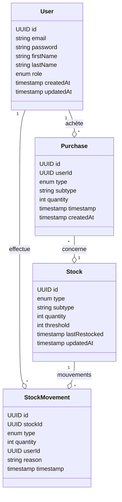

# Diagramme de classes (UML simplifié)

```mermaid
classDiagram
    class User {
        UUID id
        string email
        string password
        string firstName
        string lastName
        enum role
        timestamp createdAt
        timestamp updatedAt
    }

    class Purchase {
        UUID id
        UUID userId
        enum type
        string subtype
        int quantity
        timestamp timestamp
        timestamp createdAt
    }

    class Stock {
        UUID id
        enum type
        string subtype
        int quantity
        int threshold
        timestamp lastRestocked
        timestamp updatedAt
    }

    class StockMovement {
        UUID id
        UUID stockId
        enum type
        int quantity
        UUID userId
        string reason
        timestamp timestamp
    }

    User "1" --o "*" Purchase : achète
    User "1" --o "*" StockMovement : effectue
    Purchase "*" --o "1" Stock : concerne
    Stock "1" --o "*" StockMovement : mouvements
```

> Ce diagramme illustre les relations principales entre les entités du système (utilisateur, achat, stock, mouvement de stock).
